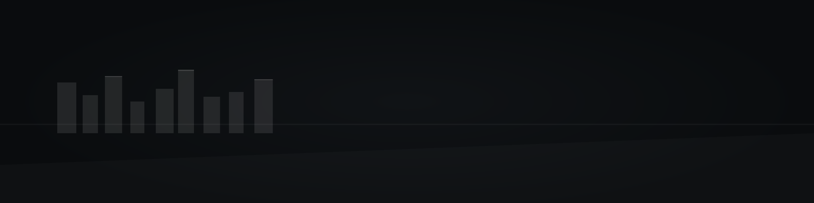

<!--
Paste into: alexdapopov/alexdapopov/README.md
Images expected in: ./assets/
- banner-dark.svg     (2560×640 recommended if exporting to PNG)
- line-chrome.svg     (thin chrome divider)
Palette: near-black #0A0C0E, silver chrome #D7D7D7 → #5E5E5E, text #C9C9C9
-->

<!-- Banner -->
<picture>
  <source media="(prefers-color-scheme: dark)" srcset="./assets/banner-dark.svg">
  
</picture>

<h1 style="margin: 16px 0 4px; font-weight: 700;">Alex Popov</h1>
Software Engineer

 

<!-- Minimal, muted badges -->

<!-- Chrome line -->

  

### Stack

| Languages | Frontend | Backend & RPC | Data | Infra & DevX |
|---|---|---|---|---|
| TypeScript · Go · Python · C++ | React · Next.js · Tailwind | Node.js · Fastify · tRPC · gRPC | Postgres · Redis · Prisma | Docker · GitHub Actions · AWS · Vercel |

  

<i>Typed edges. Observability first. Simplicity scales.</i>

